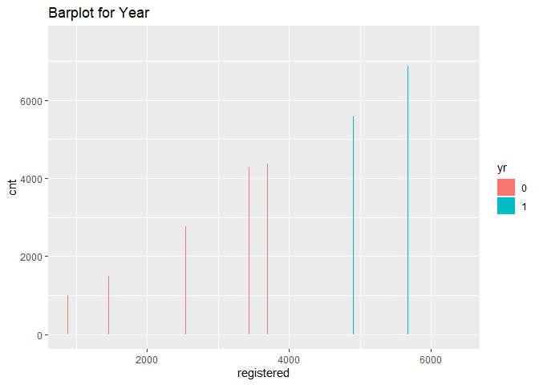

weeklyAnalysis
================
Pramodini Karwande And Deepak Karawande
7/6/2021

-   [Bike Sharing Introduction](#bike-sharing-introduction)
-   [Summary Stats](#summary-stats)
-   [Dataset Variables:](#dataset-variables)
    -   [Idea of a Linear Regression
        Model](#idea-of-a-linear-regression-model)
    -   [Idea of a Random Forest Model](#idea-of-a-random-forest-model)
    -   [Idea of a Boosted Tree Model](#idea-of-a-boosted-tree-model)


# Bike Sharing Introduction

Bike sharing system is becoming popular now a days in the cities across
the world. This allows users to rent bikes withing city for a limited
time. Using latest technologies of bike sharing system, its easy for
user to access dock from the system, rent bike from a particular
position and return the bike to the nearest dock of the destination.
*Bike Sharing System* plays important role in traffic, environmental and
health issues.Bike sharing programs have the potential to reduce the
number of cars on the roads. Thus these systems promote healthy living
and are environmentally friendly.

Bike Sharing Dataset is a dataset of rental bikes between years 2011 and
2012 in , Washington D.C., USA , avaialable from
[capitalbikeshare](http://capitalbikeshare.com/system-data) data source.
This dataset contains hourly and daily count of rental bikes. Since
[weather conditions](http://www.freemeteo.com), precipitation, day of
week, [holiday](http://dchr.dc.gov/page/holiday-schedule), season, hour
of the day can affect the rental behaviors, Bike-sharing rental process
is highly correlated to the environmental and seasonal settings.

The purpose of our analysis is the predication of bike rental count
daily based on the environmental and seasonal settings.

We will use three methods to predict `cnt` variable - Linear Regression
Model - Random Forest Model - Boosted Tree Model

``` r
# read data
bikeSharingData <- as.tibble(read.csv("./data/day.csv"))

# Filter for the day of the week, remove weekday column and convert columns to factor as appropriate.

factorCols <- c("season", "yr", "mnth", "holiday", "workingday", "weathersit")
bikeSharingData <-  bikeSharingData %>% 
                    filter(weekday == params$dayOfTheWeek) %>% 
                    select(-weekday) %>% 
                    mutate(across(factorCols, factor))
bikeSharingData <- drop_na(bikeSharingData)

#Divide Total Bike Sharing Data in Train (70%) and Test(30%) sets.
train <- sample(1:nrow(bikeSharingData), size=0.7*nrow(bikeSharingData))
bikeSharingTrainData <- bikeSharingData[train, ]
bikeSharingTestData <- bikeSharingData[-train, ]
```

# Summary Stats

Inspect if with extreme temperature do we observe reduced count.

``` r
g <-  ggplot(bikeSharingTrainData, aes(temp, cnt)) 
g + geom_point()
```

<!-- -->

Inspect if with extreme feeling temperature do we observe reduced count.

``` r
g <-  ggplot(bikeSharingTrainData, aes(atemp, cnt)) 
g + geom_point()
```

<!-- -->

Inspect if we find more count in other seasons compared to winter.

``` r
g <- ggplot(bikeSharingTrainData, aes(season, cnt))
g + geom_boxplot(fill="white") +
  geom_jitter(size=1.5, alpha=0.2, aes(col=season)) +
  labs(title="Boxplot for season")
```

<!-- -->

Do we see less count in extreme weather?

``` r
g <- ggplot(bikeSharingTrainData, aes(weathersit, cnt))
g + geom_boxplot(fill="grey") +
  geom_jitter(size=1.5, alpha=0.2, aes(col=weathersit)) +
  labs(title="Boxplot for extreme weather")
```

<!-- -->

Are cnt going up year by year?

``` r
g <- ggplot(bikeSharingTrainData,aes(registered, cnt, fill = yr))
g + geom_bar(position = "dodge", stat = "identity") +
  labs(title="Barplot for Year")
```

<!-- -->

Are more regsitered counts higher in working day?

``` r
g <- ggplot(bikeSharingTrainData,aes(workingday,registered, fill=yr))
g + geom_bar(position = "dodge", stat = "identity") +
  labs(title="Barplot for Registered Users vs Working Day")
```

<!-- -->

Are more casual counts higher in working day?

``` r
g <- ggplot(bikeSharingTrainData,aes(workingday,casual, fill=yr))
g + geom_bar(position = "dodge", stat = "identity")+
  labs(title="Barplot for Casual Users vs Working Day")
```

<!-- -->

With extreme humidity do we observe less count?

``` r
g <-  ggplot(bikeSharingTrainData, aes(hum, cnt)) 
g + geom_point() +
  labs(title="ScattePlot for Humidity vs Count")
```

<!-- --> With extreme
windspeed do we observe less count?

``` r
g <-  ggplot(bikeSharingTrainData, aes(windspeed, cnt)) 
g + geom_point()
```

<!-- --> Are counts
increasing for seasons year over year?

``` r
tbl <- table(bikeSharingData$yr, bikeSharingData$season)
kable(tbl, caption = "Year and Season Information") %>% kable_styling()
```

<table class="table" style="margin-left: auto; margin-right: auto;">
<caption>
Year and Season Information
</caption>
<thead>
<tr>
<th style="text-align:left;">
</th>
<th style="text-align:right;">
1
</th>
<th style="text-align:right;">
2
</th>
<th style="text-align:right;">
3
</th>
<th style="text-align:right;">
4
</th>
</tr>
</thead>
<tbody>
<tr>
<td style="text-align:left;">
0
</td>
<td style="text-align:right;">
12
</td>
<td style="text-align:right;">
14
</td>
<td style="text-align:right;">
13
</td>
<td style="text-align:right;">
13
</td>
</tr>
<tr>
<td style="text-align:left;">
1
</td>
<td style="text-align:right;">
14
</td>
<td style="text-align:right;">
13
</td>
<td style="text-align:right;">
13
</td>
<td style="text-align:right;">
13
</td>
</tr>
</tbody>
</table>

Is there any variation with extreme weather across seasons?

``` r
tbl <- table(bikeSharingData$weathersit, bikeSharingData$season)
kable(tbl, caption = "Weathersit and Season Information") %>% kable_styling()
```

<table class="table" style="margin-left: auto; margin-right: auto;">
<caption>
Weathersit and Season Information
</caption>
<thead>
<tr>
<th style="text-align:right;">
1
</th>
<th style="text-align:right;">
2
</th>
<th style="text-align:right;">
3
</th>
<th style="text-align:right;">
4
</th>
</tr>
</thead>
<tbody>
<tr>
<td style="text-align:right;">
18
</td>
<td style="text-align:right;">
15
</td>
<td style="text-align:right;">
18
</td>
<td style="text-align:right;">
15
</td>
</tr>
<tr>
<td style="text-align:right;">
8
</td>
<td style="text-align:right;">
12
</td>
<td style="text-align:right;">
8
</td>
<td style="text-align:right;">
9
</td>
</tr>
<tr>
<td style="text-align:right;">
0
</td>
<td style="text-align:right;">
0
</td>
<td style="text-align:right;">
0
</td>
<td style="text-align:right;">
2
</td>
</tr>
</tbody>
</table>

Are number of holidays same across years?

``` r
tbl <- table(bikeSharingData$yr, bikeSharingData$holiday)
kable(tbl, caption = "Year and Holiday Information") %>% kable_styling()
```

<table class="table" style="margin-left: auto; margin-right: auto;">
<caption>
Year and Holiday Information
</caption>
<thead>
<tr>
<th style="text-align:left;">
</th>
<th style="text-align:right;">
0
</th>
<th style="text-align:right;">
1
</th>
</tr>
</thead>
<tbody>
<tr>
<td style="text-align:left;">
0
</td>
<td style="text-align:right;">
45
</td>
<td style="text-align:right;">
7
</td>
</tr>
<tr>
<td style="text-align:left;">
1
</td>
<td style="text-align:right;">
45
</td>
<td style="text-align:right;">
8
</td>
</tr>
</tbody>
</table>

Inspect summary status of Cnt, Casual and Registered and see if for a
given weekday proportion of casual and registered varies.

``` r
kable(apply(bikeSharingData[13:15], 2, summary), caption = paste("Summary of Cnt, Casual & Registered"), digit = 1)%>% kable_styling()
```

<table class="table" style="margin-left: auto; margin-right: auto;">
<caption>
Summary of Cnt, Casual & Registered
</caption>
<thead>
<tr>
<th style="text-align:left;">
</th>
<th style="text-align:right;">
casual
</th>
<th style="text-align:right;">
registered
</th>
<th style="text-align:right;">
cnt
</th>
</tr>
</thead>
<tbody>
<tr>
<td style="text-align:left;">
Min.
</td>
<td style="text-align:right;">
2.0
</td>
<td style="text-align:right;">
20
</td>
<td style="text-align:right;">
22.0
</td>
</tr>
<tr>
<td style="text-align:left;">
1st Qu.
</td>
<td style="text-align:right;">
253.0
</td>
<td style="text-align:right;">
2549
</td>
<td style="text-align:right;">
3310.0
</td>
</tr>
<tr>
<td style="text-align:left;">
Median
</td>
<td style="text-align:right;">
690.0
</td>
<td style="text-align:right;">
3603
</td>
<td style="text-align:right;">
4359.0
</td>
</tr>
<tr>
<td style="text-align:left;">
Mean
</td>
<td style="text-align:right;">
674.1
</td>
<td style="text-align:right;">
3664
</td>
<td style="text-align:right;">
4338.1
</td>
</tr>
<tr>
<td style="text-align:left;">
3rd Qu.
</td>
<td style="text-align:right;">
904.0
</td>
<td style="text-align:right;">
4841
</td>
<td style="text-align:right;">
5875.0
</td>
</tr>
<tr>
<td style="text-align:left;">
Max.
</td>
<td style="text-align:right;">
3065.0
</td>
<td style="text-align:right;">
6435
</td>
<td style="text-align:right;">
7525.0
</td>
</tr>
</tbody>
</table>

# Dataset Variables:

We will proceed with analysis using below predictors:

1.  cnt: count of total rental bikes including both casual and
    registered. This will be the responce variable.
2.  yr : year (0: 2011, 1:2012)
3.  hr : hour (0 to 23)
4.  workingday : if day is neither weekend nor holiday is 1, otherwise
    is 0.
5.  weathersit : - 1: Clear, Few clouds, Partly cloudy, Partly cloudy -
    2: Mist + Cloudy, Mist + Broken clouds, Mist + Few clouds, Mist - 3:
    Light Snow, Light Rain + Thunderstorm + Scattered clouds, Light
    Rain + Scattered clouds - 4: Heavy Rain + Ice Pallets +
    Thunderstorm + Mist, Snow + Fog
6.  atemp: Normalized feeling temperature in Celsius. The values are
    divided to 50 (max)
7.  hum: Normalized humidity. The values are divided to 100 (max)
8.  season : season (1:springer, 2:summer, 3:fall, 4:winter)

## Idea of a Linear Regression Model

Linear regression model is one of the supervised leaning methods. Using
Linear regression both inference and predictions of response are
possible outcomes.

1.  Inferencing allows identifying variables that are important for
    explaining variability in the response. Hypothesis testing,
    confidence interval of parameters help quantify/define such
    inference.

2.  Predicting response - Not worry about which variables are important
    in model, but focus on doing good job on predicting response.

In Linear regression model, response is modeled as a linear function of
predictor/explanatory variables. Model fitting/optimization is done
using least squares as criteria. i.e. minimize sum of squares of
residuals.

## Idea of a Random Forest Model

Random forest is Tree based ensembled method. It is extension of Bagging
Method. In Bagging method we fit tree models on multiple bootstrap
resamples. We then perform multiple predictions using each of the fit
tree models and then average predictions obtained to come up with single
prediction. Random forest extends idea of Bagging method, where rather
than including every predictor, we include some set of randomly selected
predictors in the model. It has following advantages -

1.  This allows avoiding a strong predictor to overpower rest of the
    predictors.
2.  This also avoids multiple trees being similar or and hence
    predictions correlated to each other. Which in turn makes
    predictions independent and reduce variation prediction.

``` r
results <- vector()

#Random Forest Model
formula <- "";
if(params$dayOfTheWeek %in% c(0,6))
{
  #remove holiday and workingday while modelig for Saturday & Sunday
  formula <- as.formula("cnt ~ season + yr + mnth + weathersit + atemp + hum + windspeed")
} else {
  formula <- as.formula("cnt ~ season + yr + mnth + holiday + workingday + weathersit + atemp + hum + windspeed")
}

rfFit <- train( formula , 
                data=bikeSharingTrainData,
                method="rf",
                trControl = trainControl(method="repeatedcv", number=10),
                tuneGrid = data.frame(mtry = 1:20))
rfpred <- predict(rfFit, newdata = bikeSharingTestData)
results <- rbind(results, postResample(rfpred, bikeSharingTestData$cnt)[1])

#MLR Fit
mlrFit <- lm(cnt ~ season + yr + weathersit + hum + windspeed + atemp , data=bikeSharingTrainData)

pred <- predict(mlrFit, bikeSharingTestData)
results <- rbind(results,sqrt(mean((bikeSharingTestData$cnt - pred)^2)))
```

## Idea of a Boosted Tree Model

*Boosted Tree is Tree based ensembled method*.We are using Boosted Tree
Model to analyse our BikeSharing data and predict counts of Bike Rental.
**Boosting is really way to slowly trainer tree so model will not be
really overfit.** In a Boostin Tree Model, trees will be growing in a
sequential model. Each created tree is based on a previous one. Idea is
to update predictions as we go. So when we fit our model, we get
predictions. Based on that prediction We create a new model and then we
update prediction based on the new model.

**To apply this knowledge** in our Boosted Tree Model method, initial
prediction for every possible combination of values is zero. Then we are
finding residulals for every observation. Next step, we are fitting
model with d splits in it. For the first time fit of the tree, the
residulal is our response and for subsequent run of this algorithms, new
outcome of residulals is our response. Similarly, for first model fit,
we are predicting and updating our predictions for subsequent runs of
our model. Updating predictions is getting done by adding previous
prediction multiplied by growth rate, i.e. tuning paramter. Below, we
are using tuning paramter reasonably small(0.1), which helps to move
prediction slowly. And we are repeating this process number of times
using repeatedcv method which allow us to have a more accurate and
robust accuracy of the cross-validation testing. This is how our trees
will grow slowly, so data will not overfit. We are using cross
validation to choose tuning paramter, splits and repeats to get optimium
result.

``` r
# Boosted Tree Model
trctrl_boost <- expand.grid(n.trees = 500,
                    shrinkage = 0.1,
                    interaction.depth = 4,
                    n.minobsinnode = 10
                    )

boostFit <- train(cnt ~ weathersit + atemp*windspeed  + hum*atemp + yr, data = bikeSharingTrainData, 
                method = "gbm",
                trControl=trainControl(method = "repeatedcv", number = 10),
                preProcess = c("center", "scale"),
                tuneGrid   = trctrl_boost,
                verbose = FALSE,
                na.action = na.omit
                )
boostPred <- predict(boostFit, newdata = bikeSharingTestData)
results <- rbind(results, postResample(boostPred, bikeSharingTestData$cnt)[1])


mlrFit2 <- lm(cnt ~ weathersit + season*yr + atemp + hum + windspeed, data=bikeSharingTrainData)

mlrPred <- predict(mlrFit2, bikeSharingTestData)
results <- rbind(results,sqrt(mean((bikeSharingTestData$cnt - mlrPred)^2)))

rownames(results) <- c("Random Forest",  "MLR 1", "Boosted Tree",  "MLR 2")
colnames(results) <- c("RMSE")
results
```

    ##                    RMSE
    ## Random Forest 1034.3819
    ## MLR 1          975.6202
    ## Boosted Tree  1053.8740
    ## MLR 2          937.5072

``` r
weekdayNames <- c("Monday", "Tuesday", "Wednesday", "Thursday", "Friday", "Saturday", "Sunday")

paste0("Best performing model for ", weekdayNames[params$dayOfTheWeek], " is ", row.names(results)[which.min(results)])
```

    ## [1] "Best performing model for Monday is MLR 2"
