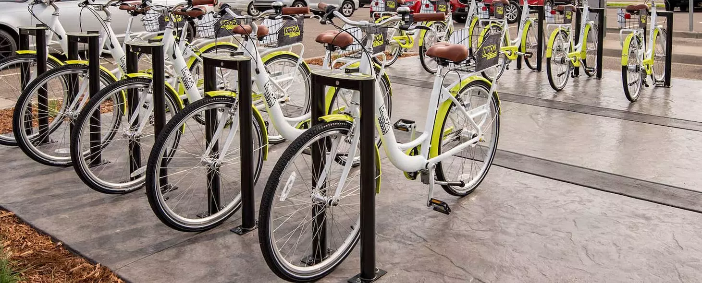

```{r setup, include=FALSE}
library(knitr)
library(ggplot2)
library(readr)
library(tidyverse)
library(GGally)
library(caret)
#install.packages("Metrics")
library(Metrics)
library(gbm)
set.seed(1234)

#opts_chunk$set(echo = TRUE, warning = FALSE, message = FALSE)
opts_chunk$set(echo = TRUE)
#
```


# Bike Sharing Introduction
Bike sharing system is becoming popular now a days in the cities across the world. This allows users to rent bikes withing city for a limited time. Using latest technologies of bike sharing system, its easy for user to access dock from the system, rent bike from a particular position and return the bike to the nearest dock of the destination. _Bike Sharing System_ plays important role in traffic, environmental and health issues.Bike sharing programs have the potential to reduce the number of cars on the roads. Thus these systems promote healthy living and are environmentally friendly.

Bike Sharing Dataset is a dataset of rental bikes between years 2011 and 2012 in , Washington D.C., USA , avaialable from [capitalbikeshare]("http://capitalbikeshare.com/system-data") data source. This dataset contains hourly and daily count of rental bikes. Since [weather conditions]("http://www.freemeteo.com"),  precipitation, day of week, [holiday]("http://dchr.dc.gov/page/holiday-schedule"), season, hour of the day can affect the rental behaviors, Bike-sharing rental process is highly correlated to the environmental and seasonal settings.

The purpose of our analysis is the predication of bike rental count hourly or daily based on the environmental and seasonal settings. To predict the number of users, we need to perform description analysis to get variables we want to work with.

```{r}
dayOfTheWeek = 1

# read data
bikeSharingData <- as.tibble(read.csv("./data/day.csv"))

# Filter for the day of the week, remove weekday column and convert columns to factor as appropriate.

factorCols <- c("season", "yr", "mnth", "holiday", "workingday", "weathersit")
bikeSharingData <-  bikeSharingData %>% 
                   # filter(weekday == dayOfTheWeek) %>% 
                    select(-weekday) %>% 
                    mutate(across(factorCols, factor))
bikeSharingData <- drop_na(bikeSharingData)
bikeSharingData

#Divide Total Bike Sharing Data in Train (70%) and Test(30%) sets.
train <- sample(1:nrow(bikeSharingData), size=0.7*nrow(bikeSharingData))
bikeSharingTrainData <- bikeSharingData[train, ]
bikeSharingTestData <- bikeSharingData[-train, ]

#With extreme temperature do we observe less count?
#Scatter plot of temp with cnt, registered, casual
g <-  ggplot(bikeSharingTrainData, aes(temp, cnt)) 
g + geom_point()

#With extreme feeling temperature do we observe less count?
#Scatter plot of atemp with cnt, registered, casual
g <-  ggplot(bikeSharingTrainData, aes(atemp, cnt)) 
g + geom_point()

#Do we see more count in other seasons compared with winter?
#Boxplot of cnt by season
g <- ggplot(bikeSharingTrainData, aes(season, cnt))
g + geom_boxplot(fill="white") +
  geom_jitter(size=1.5, alpha=0.2, aes(col=season)) +
  labs(title="Boxplot for season")


#Do we see less count in extreme weather?
#Boxplot of cnt by weathersit
g <- ggplot(bikeSharingTrainData, aes(weathersit, cnt))
g + geom_boxplot(fill="grey") +
  geom_jitter(size=1.5, alpha=0.2, aes(col=weathersit)) +
  labs(title="Boxplot for extreme weather")

#Are cnt going up year by year?
#BarPlot of cnt, casual & registered by year 
g <- ggplot(bikeSharingTrainData,aes(yr, cnt, fill = registered))
g + geom_bar(position = "dodge", stat = "identity")

#Are more regsitered counts higher in working day?
#Bar of cnt, registered & casual by workingday
g <- ggplot(bikeSharingTrainData,aes(workingday,registered, fill=yr))
g + geom_bar(position = "dodge", stat = "identity")

#Are more casual counts higher in working day?
#Bar of cnt, registered & casual by holiday
g <- ggplot(bikeSharingTrainData,aes(workingday,casual, fill=yr))
g + geom_bar(position = "dodge", stat = "identity")

#With extreme humidity do we observe less count?
#Scatter plot of hum with cnt
g <-  ggplot(bikeSharingTrainData, aes(hum, cnt)) 
g + geom_point()

#With extreme windspeed do we observe less count?
#Scatter plot of windspeed with cnt
g <-  ggplot(bikeSharingTrainData, aes(windspeed, cnt)) 
g + geom_point()

#Compute Summary Statistics

#ggpairs(bikeSharingTrainData[,-2], bin = 30)
lmod <- lm(cnt ~., data = bikeSharingTrainData[-2])
summary(lmod)

```
# Dataset Variables:
Based on the summary of full linear regression model, we will proceed with analysis using below predictors:

1. cnt: count of total rental bikes including both casual and registered. This will be the responce variable.
2. yr : year (0: 2011, 1:2012)
3. hr : hour (0 to 23)
4. workingday : if day is neither weekend nor holiday is 1, otherwise is 0.
5. weathersit : 
		- 1: Clear, Few clouds, Partly cloudy, Partly cloudy
		- 2: Mist + Cloudy, Mist + Broken clouds, Mist + Few clouds, Mist
		- 3: Light Snow, Light Rain + Thunderstorm + Scattered clouds, Light Rain + Scattered clouds
		- 4: Heavy Rain + Ice Pallets + Thunderstorm + Mist, Snow + Fog
6. atemp: Normalized feeling temperature in Celsius. The values are divided to 50 (max)
7. hum: Normalized humidity. The values are divided to 100 (max)
8. casual: count of casual users
9. registered: count of registered users


## Idea of a Linear Regression Model

Linear regression model is one of the supervised leaning methods. Using Linear regression both inference and predictions of response are possible outcomes.

1. Inferencing allows identifying variables that are important for explaining variability in the response. Hypothesis testing, confidence interval of parameters help quantify/define such inference.

2. Predicting response - Not worry about which variables are important in model, but focus on doing good job on predicting response.

In Linear regression model, response is modeled as a linear function of predictor/explanatory variables. Model fitting/optimization is done using least squares as criteria. i.e. minimize sum of squares of residuals.

## Idea of a Random Forest Model

Random forest is Tree based ensembled method. It is extension of Bagging Method. In Bagging method we fit tree models on multiple bootstrap resamples. We then perform multiple predictions using each of the fit tree models and then average predictions obtained to come up with single prediction.
Random forest extends idea of Bagging method, where rather than including every predictor, we include some set of randomly selected predictors in the model. It has following advantages - 

1. This allows avoiding a strong predictor to overpower rest of the predictors.
2. This also avoids multiple trees being similar or and hence predictions correlated to each other. Which in turn makes predictions independent and reduce variation prediction.


```{r}
results <- vector()
#Random Forest Model
rfFit <- train( cnt ~ season + yr + mnth + holiday + workingday + weathersit + atemp + hum + windspeed , 
                data=bikeSharingTrainData,
                method="rf",
                trControl = trainControl(method="repeatedcv", number=10),
                #preProcess= c("center","scale"),
                tuneGrid = data.frame(mtry = 1:20))
rfpred <- predict(rfFit, newdata = bikeSharingTestData)
results <- rbind(results, postResample(rfpred, bikeSharingTestData$cnt)[1])

#MLR Fit
mlrFit <- lm(cnt ~ season + yr + weathersit + hum + windspeed + atemp , data=bikeSharingTrainData)

pred <- predict(mlrFit, bikeSharingTestData)
results <- rbind(results,sqrt(mean((bikeSharingTestData$cnt - pred)^2)))

rownames(results) <- c("Radom Forest",  "MLR 1")
colnames(results) <- c("RMSE")
results
```

```{r}
# Boosted Tree Model
results2 <- c()
trctrl_boost <- expand.grid(n.trees = 500,
                    shrinkage = 0.1,
                    interaction.depth = 4,
                    n.minobsinnode = 10
                    )

boostFit <- train(cnt ~ weathersit + workingday + I(hum*atemp) + yr, data = bikeSharingTrainData, 
                method = "gbm",
                trControl=trainControl(method = "repeatedcv", number = 10),
                preProcess = c("center", "scale"),
                tuneGrid   = trctrl_boost,
                verbose = FALSE,
                na.action = na.omit
                )
boostPred <- predict(boostFit, newdata = bikeSharingTestData)
results2 <- rbind(results2, postResample(boostPred, bikeSharingTestData$cnt)[1])


#MLR2 Fit
mlrFit2 <- lm(cnt ~ weathersit + workingday + atemp + hum + I(yr)^2, data=bikeSharingTrainData)

mlrPred <- predict(mlrFit2, bikeSharingTestData)
results2 <- rbind(results2,sqrt(mean((bikeSharingTestData$cnt - mlrPred)^2)))

rownames(results2) <- c("Boosted Tree",  "MLR 2")
colnames(results2) <- c("RMSE")
results2

```


